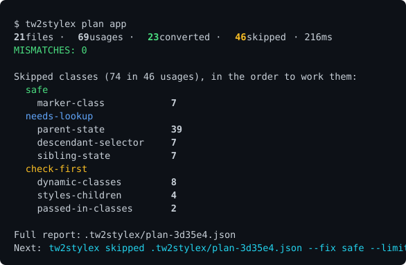

# tw2sx

Agent-driven Tailwind to StyleX migration. Converts what it can prove, and turns the rest into
work an agent can pick up.

<p>
  <a href="https://www.npmjs.com/package/tw2stylex"></a>
  <a href="https://www.npmjs.com/package/tw2stylex"></a>
  <a href="https://github.com/AlshehriAli0/tw2stylex/blob/main/LICENSE"></a>
</p>



No codemod finishes this job. tw2sx converts only what it can verify against the real StyleX
compiler, which is what `MISMATCHES: 0` means, and reports the rest as typed skips.
`tw2sx init` sets the repo up so your agent can work through them.

## Install

```bash
npm i -D tw2stylex     # bun add -d tw2stylex · pnpm add -D tw2stylex
npx tw2stylex init     # sets the repo up for your agent
```

## The loop

```bash
tw2sx plan src/components           # MISMATCHES must be 0; the skips are the work
tw2sx skipped .tw2sx/plan-*.json --fix safe
                                    # ...resolve those by hand
tw2sx apply src/components --write  # rewrites only what converts cleanly
```

Repeat until the skip count stops dropping. `plan` and `apply` agree on what converts, so the
report never promises something `apply` will skip.

| command | what it does |
|---|---|
| `tw2sx init` | Set the repo up for your agent. Safe to re-run. |
| `tw2sx explain "<classes>"` | Resolve a class string to a StyleX object. Touches nothing. |
| `tw2sx plan <path>` | Scan, convert, verify. Writes a JSON report. **Never edits code.** |
| `tw2sx apply <path>` | Rewrite the sites that convert cleanly. Dry run unless `--write`. |
| `tw2sx skipped <report>` | Re-read a report, filtered by `--reason` / `--fix`. |

## Skips

Each one says what stopped it, and how much work it will be:

| fix | means |
|---|---|
| `safe` | one right answer, fine to do in bulk |
| `check-first` | a rewrite exists but can change behaviour; read the code |
| `needs-lookup` | go find something first: a parent element, a child component |
| `unknown` | investigate; often not a Tailwind class at all |

There are 18 reasons. [reason-codes.md] walks through each one. [tokens.md] covers `@theme`
tokens and dark mode.

## For agents

The skill goes into `.claude/skills` or `.agents/skills`, whichever the project already has.
The main thing it teaches is this failure, which StyleX gives you no warning about:

```js
base:    { backgroundColor: { default: 'X', ':hover': 'Y' } }
variant: { backgroundColor: 'Z' }
stylex.props(styles.base, styles.variant)   // -> Z. The :hover rule is GONE. No error.
```

`StyleXStylesWithout` turns that into a compile error, by letting a component ban the properties
it owns from its own style prop. [component-api.md] has the pattern.

## Notes

`tailwindcss` is a peer dependency. tw2sx runs your copy, not a bundled one, so your theme and
plugins are in scope. It looks for the CSS that imports Tailwind, or a `tailwind.config` file.
Pass `--css` or `--config` if it picks the wrong one.

Pin both versions. tw2sx reaches into Tailwind's internals, and comparing skip counts between
runs only works if nothing moved underneath.

Exit codes: `0` clean · `1` finished with skips · `2` usage · `3` precondition · `10` internal.
`tw2sx help` has the flags.

Run against a production Tailwind app: 970 files, 7,125 usages, 5,509 converted, zero
mismatches, 809ms. Node and Bun produce identical output.

[SKILL.md]: skills/migrating-tailwind-to-stylex/SKILL.md
[reason-codes.md]: skills/migrating-tailwind-to-stylex/references/reason-codes.md
[tokens.md]: skills/migrating-tailwind-to-stylex/references/tokens.md
[component-api.md]: skills/migrating-tailwind-to-stylex/references/component-api.md
